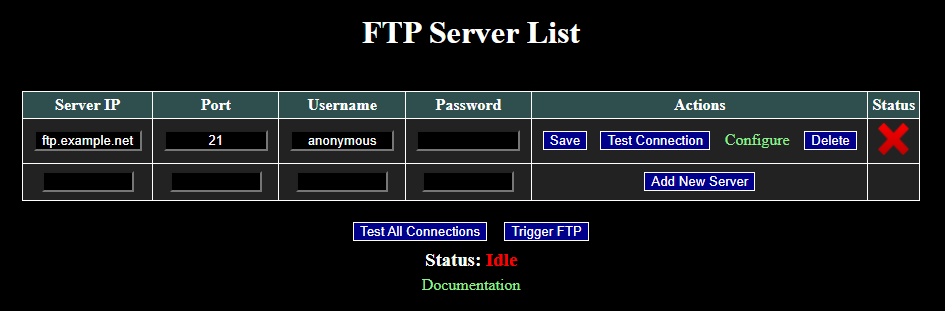
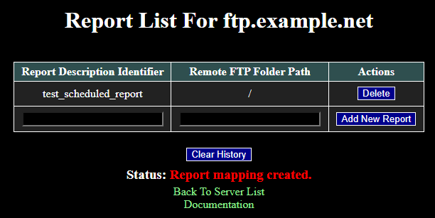

# ReportFTP

WebCTRL is a trademark of Automated Logic Corporation. Any other trademarks mentioned herein are the property of their respective owners.

This WebCTRL add-on can be configured to send scheduled reports to specific folders on FTP servers. The following protocols are supported: FTP, FTPS, and SFTP. The appropriate protocol is automatically detected for each server. If a server supports multiple protocols, preference is given to protocols that support encryption (FTPS and SFTP). The scheduled report output folder is checked hourly to see if there is anything new to send to a server.

## Screenshots

## Instructions

1. If signed add-ons are required, copy the authenticating certificate [*ACES.cer*](https://github.com/automatic-controls/addon-dev-script/blob/main/ACES.cer?raw=true) to the *./addons* directory of your *WebCTRL* installation folder.

1. Install [*ReportFTP.addon*](https://github.com/automatic-controls/report-ftp-addon/releases/latest/download/ReportFTP.addon) using the *WebCTRL* interface.

1. Navigate to this add-on's main page (e.g, *localhost/ReportFTP*).

1. Enter your server's IP address, port, username, and password. Then click the *Add New Server* button. If you are unsure which port your server uses, try ports 21 or 22. If you need to change parameters at a later time, the *Save* button can be used after alterations are made.

1. Click the *Test Connection* button to verify parameters are setup correctly. The status column will display either a green checkmark or red *X* to indicate whether a connection could be established. The add-on will automatically detect the correct protocol to use for communicating to the server. Connection testing can take a minute or two depending on circumstances, so please allow a few minutes. **If you skip this step, the add-on will fail silently.**

1. Click the *Configure* link corresponding to your server. This will open a report list page where mappings are created between scheduled reports and folders on your FTP server.

1. Enter the *Report Description Identifier* and *Remote FTP Folder Path*. Then press the *Add New Report* button to create the mapping. The *Report Description Identifier* must exactly match the description field of the scheduled report.

1. For testing, the *Trigger FTP* button on the server list webpage can be used to manually initiate the hourly check of the scheduled reports output folder.

## Additional Information

The add-on tracks which reports it has uploaded to each server, so reports are only uploaded once. Press the *Clear History* button on the report list webpage to erase these records for the selected server.

Error messages may be recorded in a system log file named *addon-ReportFTP.txt*.

[Apache Commons Net](https://commons.apache.org/proper/commons-net/) is used for an implementation of the FTP and FTPS protocols. [JSch](https://github.com/mwiede/jsch) is used for an implementation of the SFTP protocol.